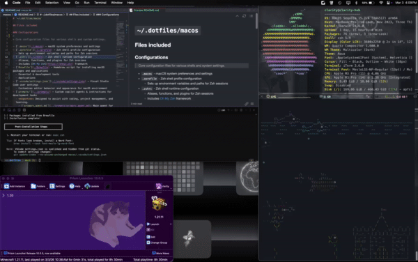
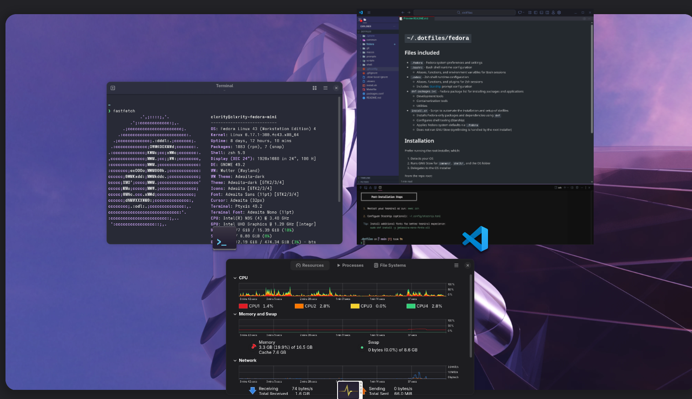

# `~/.dotfiles/`

A comprehensive repository containing all files and configurations to restore and reproduce my OS & development environment(s).

- [Operating systems](#operating-systems)
- [Scripts & Utilities](#scripts--utilities)
- [Installation](#installation)

<details>
  <summary><b>What are <i>dotfiles</i>?</b></summary>
  <br>

  > User-specific application configuration is traditionally stored in so called [dotfiles](https://en.wikipedia.org/wiki/dotfile) (files whose filename starts with a dot). It is common practice to track dotfiles with a [version control system](https://wiki.archlinux.org/title/Version_control_system) such as [Git](https://wiki.archlinux.org/title/Git) to keep track of changes and synchronize dotfiles across various hosts.
  >
> ###### *Reference:* [Arch Linux | Dotfiles](https://wiki.archlinux.org/title/Dotfiles)

</details>

---

## Operating systems

Each OS folder contains specific configurations, scripts, and installation instructions.

> Note: shared shell configs and repo-wide config live outside OS folders:
>
> - `shell/` (e.g. `.bash_profile`)
> - `common/` (e.g. `.editorconfig`)

- [macOS](./macos/README.md)
- [Fedora](./fedora/README.md)

<table>
  <tr>
    <th><a href="./macos/README.md"></a></th>
    <th><a href="./fedora/README.md"></a></th>
  </tr>
  <tr>
    <td></td>
    <td></td>
  </tr>
</table>

## Scripts & Utilities

View all scripts/utilities and how to use them by running:

```bash
make help
```

## Installation

### Clone the repository

<details>
  <summary><b>SSH</b> (alternative)</summary>
  <br>
  <blockquote>
    Cloning with SSH requires that you have your SSH keys set up with GitHub.
  </blockquote>

###### See [Connecting to GitHub with SSH](https://docs.github.com/en/authentication/connecting-to-github-with-ssh) for instructions

  ```bash
  git clone git@github.com:clxrityy/dotfiles.git ~/.dotfiles
  ```

</details>

##### Using HTTPS (recommended for most users)

```bash
# Clone the repository (HTTPS)
git clone https://github.com/clxrityy/dotfiles.git ~/.dotfiles
# Navigate to the dotfiles directory
cd ~/.dotfiles
```

#### Run the installation script

```bash
# Show help
bash install.sh --help

# Run installation (auto-detects OS, runs GNU Stow, then runs OS-specific steps)
bash install.sh
```

---

## TO-DO

- [x] CI
- [ ] Raspberry Pi
- [x] Ventoy USB setup
- [ ] Development-specific environments
- [ ] VPN configurations
- [ ] SSH config management
- [ ] Container setups (Docker)
