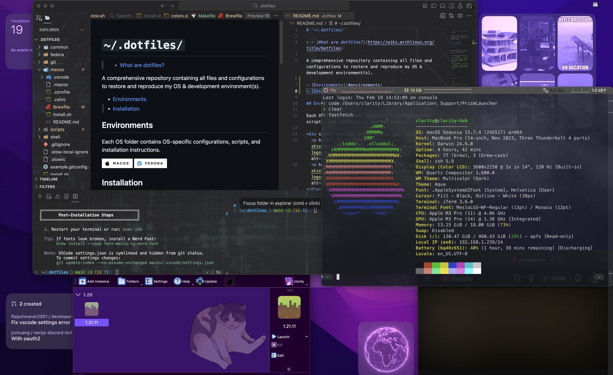

# `~/.dotfiles/macos`

## Files included

### Configurations
> Core configuration files for various shells and system settings.

- [`.macos`](./.macos) - macOS system preferences and settings
- [`.zprofile`](./.zprofile) - Zsh shell profile configuration
    - Sets up environment variables and paths for Zsh sessions
- [`.zshrc`](./.zshrc) - Zsh shell runtime configuration
    - Aliases, functions, and plugins for Zsh sessions
    - Includes [Oh My Zsh](https://ohmyz.sh/) framework
- [`Brewfile`](./Brewfile) - Homebrew script for installing macOS packages and applications
    - Essential & development tools
    - Applications
- [`.vscode/settings.json`](./.vscode/settings.json) - Visual Studio Code user settings
    - Customized settings for VSCode editor

> Note: shared shell configs and repo-wide config live outside this folder:
> - `shell/` (e.g. `.bash_profile`)
> - `common/` (e.g. `.editorconfig`)

### Utilities
> Files that assist in managing or enhancing the dotfiles repository.

This folder does not contain repo-wide utility files.
See the repo root for:
- `.stowrc` / `.stow-local-ignore` (GNU Stow configuration)
- `common/` (EditorConfig, etc.)

### Scripts
> Custom scripts for automating tasks related to dotfiles management.
> See [installation section](#installation) for usage.

- [`install.sh`](./install.sh) - Script to automate the installation and setup of dotfiles
    - Installs macOS-only packages and dependencies (Homebrew + Brewfile)
    - Configures shell tooling (Oh My Zsh, Powerlevel10k)
    - Applies macOS system defaults via `.macos`
    - Does not run GNU Stow (symlinking is handled by the root installer)

## Installation

Prefer running the root installer, which:
1) Detects your OS
2) Runs GNU Stow for `common/`, `shell/`, and the OS folder
3) Delegates to the OS installer

From the repo root:

```bash
bash install.sh
```

To run only the macOS steps (without stow), from the repo root:

```bash
bash macos/install.sh
```

---


